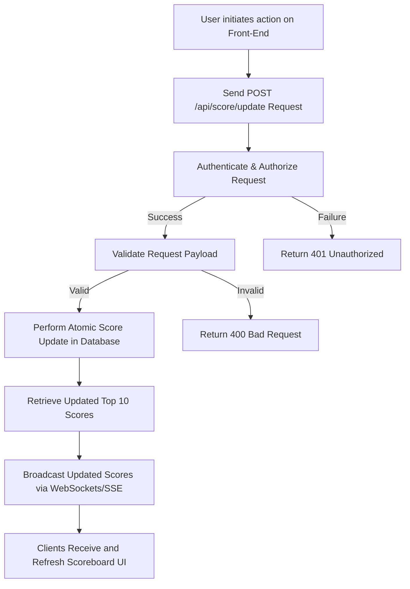

# Scoreboard API Service Module Specification

**Version:** 1.1  
**Author:** Cyrus David Pastelero  
**Date:** 02/26/2025

---

## Table of Contents

1. [Introduction](#introduction)
2. [Features](#features)
3. [Architecture & Components](#architecture--components)
4. [System Design Overview & Requirements](#system-design-overview--requirements)
   - [4.1 Fundamental Goal & Top Use Case](#41-fundamental-goal--top-use-case)
   - [4.2 Stakeholders](#42-stakeholders)
   - [4.3 Scope & Out-of-Scope](#43-scope--out-of-scope)
   - [4.4 Top Functional Requirements](#44-top-functional-requirements)
   - [4.5 Top Non-Functional Requirements](#45-top-non-functional-requirements)
   - [4.6 Constraints & Considerations](#46-constraints--considerations)
5. [Data Model](#data-model)
6. [API Endpoints](#api-endpoints)
   - [6.1 POST /api/score/update](#61-post-apiscoreupdate)
   - [6.2 GET /api/scoreboard](#62-get-apiscoreboard)
7. [Live Update Mechanism](#live-update-mechanism)
8. [Execution Flow Diagram](#execution-flow-diagram)
9. [Security Considerations](#security-considerations)

---

## 1. Introduction

The **Scoreboard API Service** module is designed to provide a robust, secure, and scalable backend solution for managing user score updates and delivering real-time leaderboard information. This document serves as a comprehensive guide for backend developers, outlining the architecture, API design, and integration points required to implement and maintain the service.

Key aspects of the module include:

- **Secure Score Updates:**  
  Only authorized requests with valid authentication tokens can update user scores, ensuring data integrity and preventing unauthorized modifications.

- **Real-Time Leaderboard Broadcasts:**  
  The service employs real-time messaging protocols (such as WebSockets or Server-Sent Events) to instantly push updated scoreboard information to all connected clients, ensuring that users receive immediate feedback on score changes.

- **Scalable Architecture:**  
  Designed to handle high volumes of concurrent updates, the module supports horizontal scaling and is optimized for low latency, making it suitable for competitive and interactive environments such as online gaming, educational platforms, and sales leaderboards.

This document provides detailed specifications, including data models, API endpoints, and system design requirements, enabling developers to integrate and extend the Scoreboard API Service effectively within their applications.

## 3. Architecture & Components

The Scoreboard API Service is built with a modular architecture that emphasizes scalability, security, and real-time performance. The key components of the system are as follows:

- **API Endpoints:**  
  The service provides two primary endpoints:

  - **Score Update Endpoint:**  
    Accepts authorized requests to update user scores. This endpoint performs atomic operations to ensure data consistency during concurrent updates.
  - **Scoreboard Retrieval Endpoint:**  
    Returns the current top leaderboard, sorted in descending order by score.

- **Authentication & Authorization:**  
  Utilizes token-based authentication (e.g., JWT) to secure all endpoints, ensuring that only authorized clients can update scores or access sensitive data.

- **Database:**  
  A persistent data store maintains user records and their scores. Key optimizations include:

  - **Indexing:**  
    Indexing critical fields such as `score` to expedite leaderboard queries.
  - **Atomic Operations:**  
    Support for atomic updates to prevent race conditions during simultaneous score modifications.

- **Real-Time Messaging:**  
  Employs real-time communication protocols to ensure that scoreboard updates are instantly broadcast to all connected clients:

  - **WebSockets or Server-Sent Events (SSE):**  
    These technologies enable low-latency updates and maintain an interactive user experience.

- **Validation & Security:**  
  Comprehensive measures are in place to protect the system from misuse:

  - **Input Validation:**  
    Sanitizes all incoming requests to prevent injection attacks.
  - **Rate Limiting:**  
    Controls the frequency of requests to avoid abuse and ensure service availability.
  - **Detailed Logging:**  
    Logs critical operations and errors to aid in debugging and auditing.

- **Monitoring & Logging:**  
  Continuous monitoring of system performance is implemented to ensure reliability:
  - **Real-Time Performance Tracking:**  
    Integrated logging provides visibility into system operations and helps in the rapid detection of issues.
  - **Alerting:**  
    Configured alerts notify administrators of potential problems, ensuring prompt resolution.

---

## 4. System Design Overview & Requirements

### 4.1 Fundamental Goal & Top Use Case

- **Fundamental Goal:**  
  Provide a robust, secure, and scalable mechanism to update user scores in real time and deliver accurate leaderboard information to all clients.

- **Rationale:**  
  In dynamic, competitive environments such as online gaming, educational platforms, or sales leaderboards, users expect immediate feedback on their performance. This system ensures data integrity and a seamless user experience.

- **Top Use Case:**  
  When a user completes an action that increases their score, the system processes the update atomically, recalculates the top 10 rankings, and immediately broadcasts the updated leaderboard to all connected clients.

---

### 4.2 Stakeholders

- **End Users:**  
  Participants or players who rely on timely score updates and leaderboards to track their performance.

- **Developers & Integrators:**  
  Engineers integrating the scoreboard service into various applications, ensuring interoperability and performance.

- **Product Owners/Business Stakeholders:**  
  Decision-makers who set feature priorities and performance benchmarks based on user engagement and business objectives.

- **System Administrators & DevOps:**  
  Teams responsible for deployment, scaling, and maintaining system uptime and performance.

- **Security & Compliance Teams:**  
  Ensure that the system adheres to security standards and regulatory requirements.

- **External Services:**  
  Systems such as authentication providers and databases that interact with the service.

---

### 4.3 Scope & Out-of-Scope

- **In Scope:**

  - Securely receiving and processing score update requests.
  - Retrieving and delivering the current top 10 leaderboard data.
  - Broadcasting real-time updates via WebSockets or SSE.
  - Enforcing authentication, authorization, and input validation.
  - Logging operational data and error events.

- **Out of Scope:**
  - User account management (registration, profile updates).
  - Advanced analytics or historical reporting beyond the real-time leaderboard.
  - Additional gamification features such as badges or rewards.
  - Client-side UI implementation.

---

### 4.4 Top Functional Requirements

- **Score Update:**  
  Securely update user scores using atomic operations.

- **Leaderboard Retrieval:**  
  Provide an endpoint to retrieve the current top 10 scores.

- **Real-Time Broadcasting:**  
  Immediately push updated leaderboards to all connected clients when scores change.

- **Error Handling:**  
  Return standardized error responses and log all significant transactions and errors.

- **Authentication & Authorization:**  
  Enforce token-based security to restrict access to sensitive operations.

---

### 4.5 Top Non-Functional Requirements

- **Scalability:**  
  Support horizontal scaling to handle increasing traffic and concurrent score updates.

- **Performance:**  
  Maintain low latency for both score updates and real-time notifications.

- **Reliability & Fault Tolerance:**  
  Ensure data consistency and system availability through atomic operations and robust error handling.

- **Security:**  
  Protect data in transit using HTTPS and secure messaging protocols (WSS), and enforce strict authentication measures.

- **Maintainability:**  
  Use a modular design with clear documentation to facilitate ongoing maintenance.

- **Extensibility:**  
  Allow for future enhancements, such as additional endpoints or integration with other services.

---

### 4.6 Constraints & Considerations

- **Team Size & Skillset:**  
  Developed by a small, agile backend team experienced in Node.js, REST APIs, and real-time communication protocols.

- **Technology Stack:**  
  Implemented using modern JavaScript (or TypeScript) frameworks, integrating seamlessly with the chosen database and messaging libraries.

- **Regulatory & Compliance:**  
  Must adhere to relevant security standards and data protection regulations (e.g., GDPR, CCPA) when handling user data.

- **Operational Environment:**  
  Optimized to function efficiently within existing infrastructure constraints, including network latency, rate limiting, and server capacity.

---

## 5. Data Model

The service uses a JSON schema to represent user scores. The table below summarizes the fields, their types, and their descriptions:

| **Field**   | **Type** | **Description**                     |
| ----------- | -------- | ----------------------------------- |
| `userId`    | String   | Unique identifier for the user.     |
| `score`     | Number   | Total score of the user.            |
| `updatedAt` | DateTime | Timestamp of the last score update. |

**Example Document:**

```json
{
  "userId": "user123",
  "score": 1200,
  "updatedAt": "2025-02-25T15:30:00Z"
}
```

> **Note:** Additional fields such as `username` or `email` can be added as needed. Indexing the `score` field is recommended to expedite leaderboard queries.

---

## 6. API Endpoints

### 6.1 POST /api/score/update

**Purpose:**  
Processes score update requests when a user performs an action, securely updating the user's score and triggering a real-time leaderboard refresh.

**Request Headers:**

- `Authorization: Bearer <token>`  
  Token-based authentication header ensuring the request originates from an authorized source.

**Request Body (JSON):**

```json
{
  "userId": "string",
  "scoreIncrement": 50
}
```

**Request Body Details:**

| **Field**        | **Type** | **Required** | **Description**                               |
| ---------------- | -------- | ------------ | --------------------------------------------- |
| `userId`         | String   | Yes          | Unique identifier for the user.               |
| `scoreIncrement` | Number   | Yes          | The value to add to the user's current score. |

**Response Codes:**

- **200 OK:**  
  The score update was successful. The response returns the updated score along with a success message.

  ```json
  {
    "userId": "user123",
    "newScore": 1250,
    "message": "Score updated successfully."
  }
  ```

- **401 Unauthorized:**  
  The request is rejected due to an invalid or missing authorization token.

  ```json
  {
    "error": "Unauthorized",
    "message": "Invalid or missing authorization token."
  }
  ```

- **400 Bad Request:**  
  The request payload is malformed or missing required fields.

  ```json
  {
    "error": "BadRequest",
    "message": "The request body is missing required fields."
  }
  ```

- **429 Too Many Requests:**  
  The request rate has exceeded the allowed limit.

  ```json
  {
    "error": "TooManyRequests",
    "message": "Rate limit exceeded. Please try again later."
  }
  ```

**Processing Steps:**

1. **Authentication & Authorization:**  
   Validate the provided bearer token.
2. **Payload Validation:**  
   Confirm that both `userId` and `scoreIncrement` are present and valid.
3. **Score Update:**  
   Execute an atomic update in the database to increment the user's score, preventing race conditions.
4. **Scoreboard Retrieval:**  
   Query the database to fetch the updated top 10 scores.
5. **Live Update:**  
   Broadcast the updated scoreboard to all connected clients using WebSockets or SSE.

---

### 6.2 GET /api/scoreboard

**Purpose:**  
Retrieves the current top 10 leaderboard entries, sorted in descending order by score.

**Response (200 OK):**

Returns a JSON array containing user objects with `userId` and `score` fields.

```json
[
  {
    "userId": "topUser1",
    "score": 3000
  },
  {
    "userId": "topUser2",
    "score": 2950
  }
  // ... up to 10 users
]
```

> **Note:**  
> If fewer than 10 users exist, the endpoint returns all available user scores. Caching this result during high-traffic periods is recommended to reduce database load.

---

## 7. Live Update Mechanism

The service uses real-time mechanisms (WebSockets or SSE) to ensure all connected clients receive instant scoreboard updates.

- **Mechanism:**
  After a score update, the server fetches the updated top 10 scores and broadcasts them to clients.
- **Workflow:**

  1.  The **POST /api/score/update** endpoint processes the score update.
  2.  The updated top 10 list is retrieved from the database.
  3.  A WebSocket or SSE message is sent to all connected clients.
  4.  Clients update their UI with the new scoreboard data.

**Example WebSocket Message:**

```json
{
  "eventType": "scoreUpdate",
  "payload": [
    {
      "userId": "topUser1",
      "score": 3000
    }
    // ... other top scores
  ]
}
```

---

## 8. Execution Flow Diagram



---

## 9. Security Considerations

- **Authentication:**  
  Enforce token-based (JWT) authentication for all score update requests.
- **Input Validation:**  
  Validate and sanitize all input fields to mitigate injection attacks.
- **Rate Limiting:**  
  Implement rate limiting (e.g., by IP or user ID) to prevent abuse.
- **Concurrency & Atomicity:**  
  Use atomic operations to handle concurrent updates and maintain data consistency.
- **Logging & Monitoring:**  
  Log critical events and continuously monitor performance for prompt issue detection.
- **Transport Security:**  
  Secure data in transit using HTTPS and secure WebSocket (WSS) connections.
